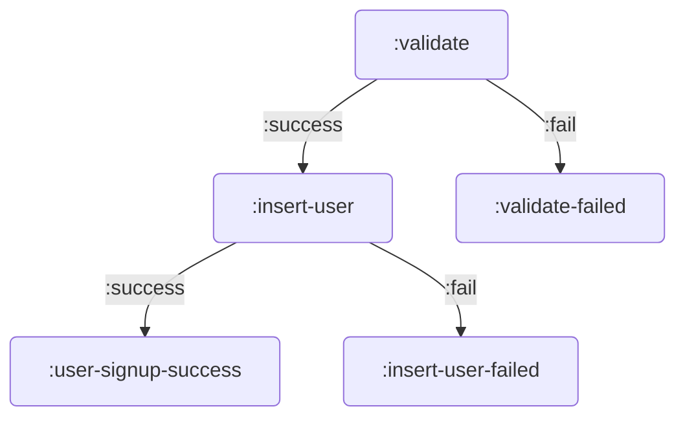
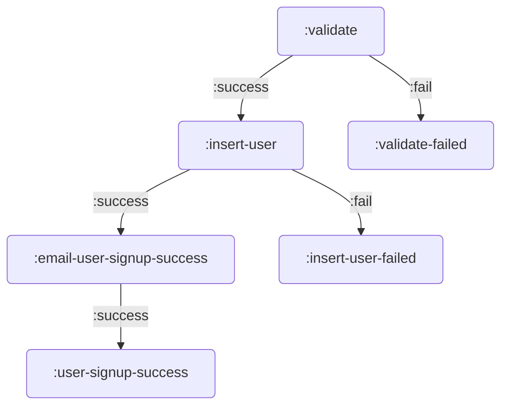

[](https://clojars.org/party.donut/graphputer)

# graphputer

Ready to 'pute some graphs??

## What is this?

graphputer lets you decompose some computation into a directed graph of
computations. Let's say you're writing a user signup API endpoint. Instead of
writing something like this:

``` clojure
;; assume `validate` and `insert-user` are defined
(defn user-signup
  [params]
  (if-let [validation-errors (validate params)]
    (if-let [user (insert-user params)]
      {:status 200
       :body   user}
      {:status 500})
    {:status 400
     :body validation-errors}))
     
(user-signup {:username "newuser"})
```

You can write something like this:

``` clojure
(require '[donut.graphputer :as puter])

(def user-signup-graph
  {:id   :user-signup
   :init :validate
   :nodes
   {:validate
    {:pute    (fn [user-params]
                (if-let [validation-errors (validate user-params)]
                  [::puter/fail validation-errors]
                  user-params))
     ;; the vector [::puter/fail ...] tells graphputer to follow
     ;; the :fail branch
     :success :insert-user
     :fail    :validate-failed}

    :validate-failed
    {:pute (fn [validation-errors]
             {:status 400
              :body   validation-errors})}

    :insert-user
    {:pute    (fn [user-params]
                (if-let [inserted-user (insert-user user-params)]
                  inserted-user
                  ::puter/fail)) ;; you can also use just ::puter/fail to go to fail branch
     :success :user-signup-success
     :fail    :insert-user-failed}

    :insert-user-failed
    {:pute (constantly {:status 500})}

    :user-signup-success
    {:pute (fn [inserted-user]
             {:status 200
              :body   inserted-user})}}})

(puter/execute user-signup-graph {:username "newuser"})
```



## Uh, why?

Why would anyone want to do this? Honestly, it might be a bad idea. You tell me!
It's an experiment.

The immediate motivating reason is to enable the creation of libraries that have
nested control flow for coordinating multiple conditions and side-effecting
behavior, while remaining extensible by the user.

For example, I want it to be possible to create a lib for web app backends that
can capture the core workflow for signing up a user, while allowing a dev to add
their own custom behavior. A developer might want to email a user after
successfully inserting their record in your db. You could do that like this:

``` clojure
(def my-user-signup-graph
  (puter/splice-node
   user-signup-graph
   :email-user-signup-success
   {:pute (fn [inserted-user] (email-user inserted-user))}
   :insert-user))
```

This will insert a new computation node under the `:email-user-signup-success
key`, and changes the `:insert-user` node so that its `:success` points to
`:email-user-signup-success`. The `:email-user-signup-success` node's `:success`
points to `:user-signup-success`.



Another benefit of this approach is that it opens up possibilities for
documenting your library. It's possible to visualize the compute graph and put
it in your readme, making it easier for devs to understand what your lib is
doing.

## How it works

`donut.graphputer/execute` takes two arguments, a graph and the graph's initial
execution parameter. When youc all `donut.graphputer/execute`, it looks the node
named by `:init` and calls its `:pute` function with one argument, the initial
execution parameter. In the example above, `:validate`'s `:pute` gets called
with the map `{:username "newuser"}`.

If a `:pute` function returns either `:donut.graphputer/fail` or a vector whose
first element is `:donut.graphputer/fail`, then execution flow goes to the
computation node named by `:fail`. So with `:validate`, the `:fail` node would
be `:validate-failed`.

Otherwise, execution flow goes to the `:success` node and the next `:pute`
function is called with the return value of the previous `:pute` function. In
the example above, `:user-signup-success` gets called with the value returned by
`(insert-user user-params)`.

If `:success` or `:fail` isn't defined, then execution stops and the last
computed value is return.

## Isn't this a state machine?

Not really. Unlike a state machine, you don't send it events to advance states.
